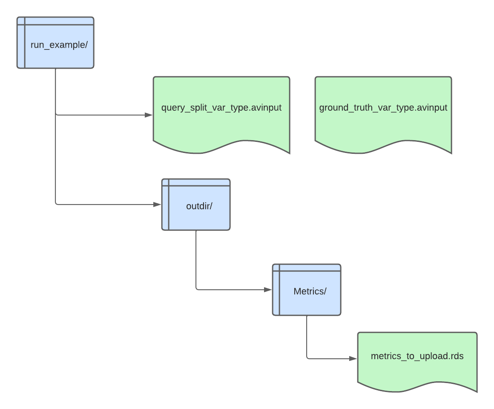

RecallME: a tool for VCF files comparison and efficient validation method
=============


RecallME is a containerized python tool for VCF file comparison and variant calling pipelines benchmarking and optimization.

### Quick start
To run RecallME you need to activate the conda environment and to install singularity (> v.3) and ANNOVAR (it requires a license free of charge for non-commercial purposes). For more information about ANNOVAR, please visit the <a href="https://annovar.openbioinformatics.org/en/latest/" target="_blank"> official website</a>

### Installation and setup
To start using RecallME v.0.2, type the following commands:
```
git clone https://github.com/mazzalab-ieo/recallme.git
cd recallme/
conda env create --file env.txt --name {name_env}
```

### Basic commands
To run a comparison, type:
```
python RecallME.py -q $QUERY_VCF \
--high_conf_bed $BED \
--query_format VCF \
-g $GROUND_TRUTH \
--gt_format VCF \
-f $FASTA \
--genome_bed $GENOME_BED \
-b $BAM \
-a $ANNOVAR_DIR \
-o $OUT_DIR \
--caller $CALLER_NAME 
```

* **GENOME_BED** is a bedtools specific bed file with chromosome sizes in bps (i.e. chr1 n) or a .fai index.
* **BAM** file for query
* **ANNOVAR_DIR** the directory where is stored convert2annovar.pl which is required for running RecallME
* **CALLER_NAME** the name of the caller used to produce the query VCF file (GATK, TVC, Deepvariant, VarScan, LoFreq)

For more info on required and not required commands, please type:
```
python RecallME.py --help
```
### Tutorial 
To run the example, open a terminal and type:
```
conda activate {name_env}
cd recallme/
#add the annovar folder within run_example.sh
bash run_example.sh
```

<code>run_example.sh</code> produces an outdir/ folder in the run_example/ directory as follows:<br>


              
After the output has been generated, go to the <a href="https://translational-oncology-lab.shinyapps.io/recallme/" target="_blank">web app</a> and load the AVinputs (query_split_var_type.avinput + ground_truth_var_type.avinput) and the rds object to visualize your results and to optimize your pipeline.

For additional information, please check the <a href="https://translational-oncology-lab.shinyapps.io/recallme/" target="_blank">about</a> page for interrogating the manual.

### License

RecallME is under [MIT License](LICENSE).
BEDTOOLS is under [GNU General Public License](BEDTOOLS_LICENSE).
